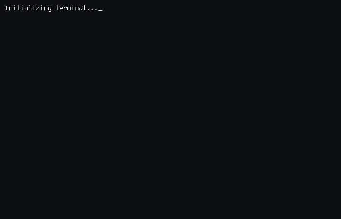

<h1 align="center">Rohit Goswami</h1>

---

---

<h3 align="center">About Me</h3>

- 🔭 I've shipped **5+ client projects** with **3+ production deployments** on Play Store, App Store & Web
- 🌱 Currently pursuing **BCA (AI & ML)** at JECRC University — CGPA 8.51
- 💬 Ask me about **Flutter, Firebase, AI/ML, Embedded Systems**
- 🏆 **Top 20 of 500+ teams** — Smart India Hackathon 2025

---

<h3 align="center">Tech Stack</h3>

---

<h3 align="center">GitHub Stats</h3>

---

---

<h3 align="center">Contribution Graph</h3>

